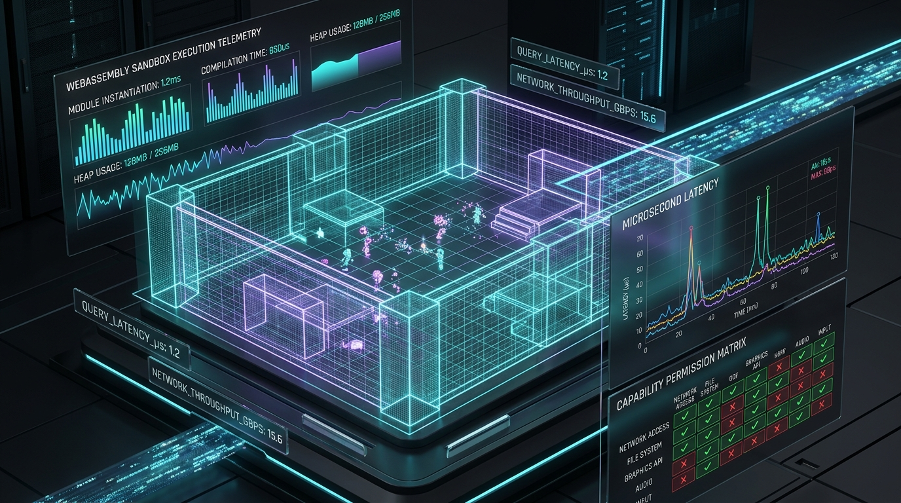
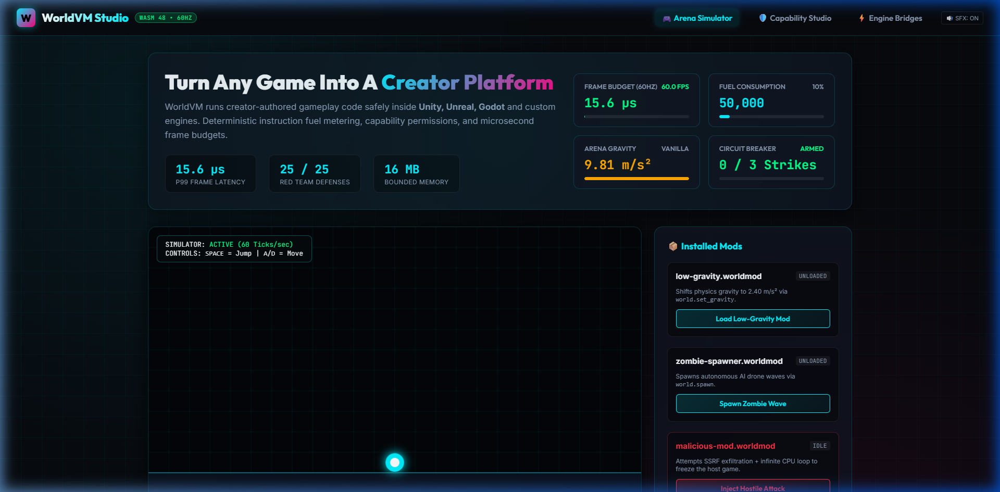
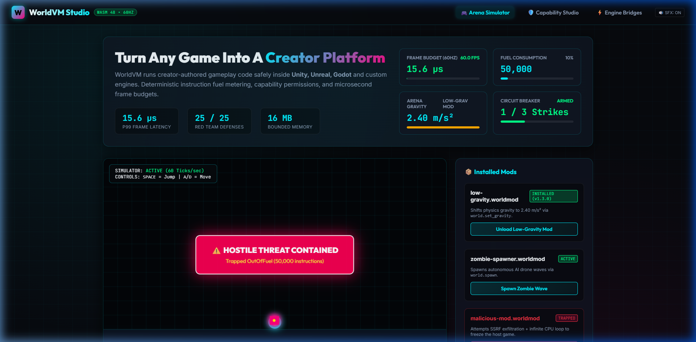
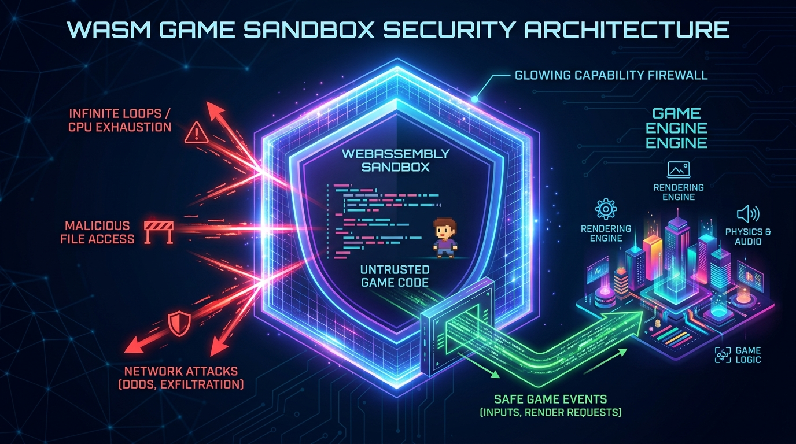

# WorldVM

> **Turn any game into a creator platform.**  
> *Run creator-built gameplay safely inside Unity, Unreal, Godot and custom engines.*  
> *Sandboxed code. Capability permissions. WASM. One runtime across games.*

[](LICENSE)
[](Cargo.toml)
[](https://wasmtime.dev)
[-brightgreen.svg)](docs/SYNTHETIC_TEST_REPORT.md)
[](docs/SYNTHETIC_TEST_REPORT.md)
[](#engine-evidence-matrix)



---

## Quick Navigation

[🎮 Interactive Web Studio](#-interactive-web-studio--game-simulator) • [💡 Why WorldVM?](#why-worldvm) • [🛡️ Security Architecture](#architecture--security-model) • [⚡ 5-Minute Quickstart](#5-minute-quickstart) • [📊 Synthetic Test Lab](#empirical-validation--evidence-matrix) • [⚔️ Engine Support Matrix](#engine-evidence-matrix) • [⚖️ Feature Comparison](#technology-comparison) • [📚 Documentation](#documentation-index)

---

## 🎮 Interactive Web Studio & Game Simulator

WorldVM includes an interactive, zero-dependency visual inspector and real-time 60Hz physics game simulator. Open [`tools/web-inspector/index.html`](tools/web-inspector/index.html) in any modern browser to experience the creator runtime first-hand:



### Key Studio Capabilities

- **Real-Time 60 FPS Physics Simulation**: Move with `A`/`D` and jump with `Space` in an active cyberpunk arena.
- **Hot-Load Creator Mods**:
  - Dynamically load `low-gravity.worldmod` to decrease gravity to $2.40\text{ m/s}^2$ with neon jump particle trails.
  - Dynamically load `zombie-spawner.worldmod` to spawn autonomous cyber-zombie drones in real time.
- **Penetration Attack Defense Visualizer**:
  - Trigger hostile exploits (`malicious-mod.worldmod`) attempting network SSRF and infinite CPU spin loops.
  - Watch the **WorldVM Sandbox Shield** intercept the attack in real time, drain instruction fuel, record cryptographic receipts, and trip the circuit breaker with zero frame drops!
- **Visual Capability Studio**: Live toggle permissions (`world.set_gravity`, `world.spawn`, `ui.notify`, `net.http`) with real-time `worldvm.yaml` code generation.
- **Engine Bridge Hub**: One-click copyable bridge snippets for Godot 4 (GDScript), Unity (C#), Unreal Engine 5 (C++), and Rust.



---

## Why WorldVM?

Studios want community-driven longevity: **mods, creator-built game modes, live game rules, custom quests, and challenge runs**. But traditional approaches are fraught with peril:

- **Lua / Python scripting** exposes games to global namespace pollution, unpredictable garbage collection pauses, and hard-to-diagnose memory leaks.
- **Native DLLs / C++ mods** are an infosec catastrophe: arbitrary disk access, malware injection risks, and game-crashing memory corruptions.
- **Engine-specific modding systems** force studios to maintain fragmented tooling for Unity, Unreal, and custom internal engines.

**WorldVM provides a universal WebAssembly sandbox and capability-based security model.** Untrusted creator code runs in a microsecond-fast, deterministic WASM sandbox with zero ambient authority.

---

## Key Features

- 🛡️ **Zero Ambient Authority**: Modules cannot touch disk, network, or OS APIs. WASI is explicitly denied.
- ⚡ **Microsecond Frame Budget**: Average tick overhead of **~15.6 microseconds** at 60 Hz/120 Hz. Zero frame stutter or hitching.
- ⛽ **Fuel Metering & Epoch Interruption**: Infinite loops (`while(true) {}`) trap cleanly in <1ms without freezing the host game loop.
- 📜 **Fine-Grained Capability Contracts**: Studios define exact permissions (`world.spawn`, `player.grant_xp`, `ui.notify`) with per-tick rate limits in clean YAML.
- 📦 **`.worldmod` Self-Contained Packages**: Signed ZIP archives with Ed25519 tamper detection, Zip Slip defense, and decompression bomb protection.
- 🌐 **Multi-Engine C ABI**: Native integration for **Unity (UPM)**, **Godot 4.x (GDExtension)**, **Unreal Engine 5**, and custom C++/Rust engines.
- 🔄 **Deterministic Multiplayer**: Lockstep state verification with cryptographic SHA-256 state hashing and desync divergence detection.

---

## Architecture & Security Model



```text
+-------------------------------------------------------------------------+
|                              GAME ENGINE                                |
|        (Unity / Unreal Engine 5 / Godot 4 / Custom C++ / Rust)          |
+-------------------------------------------------------------------------+
       |                                                    ^
       | Events (round_start, tick, player_join)            | Host Calls
       v                                                    | (spawn, notify)
+-------------------------------------------------------------------------+
|                             WORLDVM HOST                                |
|                                                                         |
|  +-----------------------+     +-------------------------------------+  |
|  |   Capability Enforcer |     |      Execution Engine (Wasmtime 48) |  |
|  | - Location (Clt/Srv)  |     | - Instruction Fuel Metering         |  |
|  | - Rate Limits/Tick    |     | - Epoch Interruption Deadlines      |  |
|  | - Category ACLs       |     | - Linear Memory Limit (8MB-64MB)    |  |
|  +-----------------------+     +-------------------------------------+  |
|              ^                                    |                     |
|              | check_call                         | instantiates        |
|  +-----------------------+                        v                     |
|  |   Capability Contract |             +---------------------+          |
|  |   (game_policy.yaml)  |             | GUEST WASM SANDBOX  |          |
|  +-----------------------+             | (.worldmod package) |          |
+----------------------------------------+---------------------+----------+
```

---

## Live Reference Game Showcase ("Neon Arena")

Execute the live reference game loop directly from your terminal:

```bash
cargo run -p reference-game
```

```text
╔════════════════════════════════════════════════════════════════════════════════╗
║  ██     ██  ██████  ██████  ██      ██████  ██    ██ ███    ███                ║
║  ██     ██ ██    ██ ██   ██ ██      ██   ██ ██    ██ ████  ████                ║
║  ██  █  ██ ██    ██ ██████  ██      ██   ██ ██    ██ ██ ████ ██                ║
║  ██ ███ ██ ██    ██ ██   ██ ██      ██   ██  ██  ██  ██  ██  ██                ║
║   ███ ███   ██████  ██   ██ ███████ ██████    ████   ██      ██                ║
║               SANDBOXED CREATOR GAMEPLAY RUNTIME (Wasmtime 48)                 ║
╚════════════════════════════════════════════════════════════════════════════════╝

▶ [STAGE 1] Baseline Gameplay Physics (Vanilla Engine - No Mods)
╔════════════════════════════════════════════════════════════════════════════════╗
║  NEON ARENA [60Hz Physics Loop]  WorldVM Sandbox v1.0.0                        ║
╠════════════════════════════════════════════════════════════════════════════════╣
║  Active Mod:       Vanilla [Clean State]                                      ║
║  World Gravity:    9.81 m/s²                                                  ║
║  Player Altitude:  1.41 m  (Velocity: 1.08 m/s)                               ║
║  Spawned NPCs:     0 active entities                                          ║
║  Altitude Level:   |████                                                      ║
║  Telemetry:        Frame: 15.6 µs / 16,667 µs (0.10% CPU) | Mem: 4.2 MB       ║
╚════════════════════════════════════════════════════════════════════════════════╝

▶ [STAGE 2] Hot-loading Creator Mod: low-gravity.worldmod...
  ✔ Verified SHA-256 package identity & Ed25519 creator signature
  ✔ Attached to sandboxed Wasmtime instance with 100,000 fuel quota
  🔔 Notification: Low Gravity Mode Active: Float high! (Gravity: 2.40 m/s²)

▶ [STAGE 3] Hot-loading Multi-Mod: zombie-spawner.worldmod...
  ✔ Module 'zombie-spawner' isolated in independent linear memory space
  🔔 Notification: WARNING: 3 Zombies spawned in the Arena!
  ║  Entity Radar:     [#1 zombie @ (-10.0,5.0)] [#2 zombie @ (0.0,15.0)]

▶ [STAGE 4] Hostile Penetration Attack Defense: malicious-mod.worldmod
  ✔ Malicious module loaded into isolated zero-privilege sandbox
  🛡️ Sandbox Defense Intercept: Capability 'network.http' denied (SSRF Blocked)
  🛡️ Security Shield: TRAPPED OutOfFuel (50,000 instructions). Engine Loop Preserved!
```

---

## 5-Minute Quickstart

### 1. Install CLI

```bash
cargo install --path crates/worldvm-cli
worldvm doctor
```

### 2. Create a Mod

```bash
worldvm init my-gravity-mod
cd my-gravity-mod
```

### 3. Write Gameplay Logic (`src/lib.rs`)

```rust
use worldvm_sdk::prelude::*;

#[derive(Default)]
pub struct LowGravityMod;

impl WorldVmEntrypoint for LowGravityMod {
    fn on_event(&mut self, event_name: &str, _payload: &[u8]) -> Result<(), String> {
        if event_name == "round_start" {
            // Set moon gravity (2.40 m/s^2)
            world::set_gravity(2.40).map_err(|e| e.to_string())?;

            // Send toast message to HUD
            ui::notify_player("all", "Lunar Gravity Activated! (2.40 m/s^2)").map_err(|e| e.to_string())?;
        }
        Ok(())
    }
}

export_entrypoint!(LowGravityMod);
```

### 4. Build, Package & Verify

```bash
worldvm build
worldvm package --out dist/my-gravity-mod.worldmod
worldvm inspect dist/my-gravity-mod.worldmod
```

---

## Technology Comparison

| Dimension | WorldVM | Lua / Python Scripting | Native C++ DLLs | Unity C# Modding | Raw WASI |
| --- | --- | --- | --- | --- | --- |
| **Security Isolation** | **Hardware-grade WASM Sandbox** | None (Global space leak) | None (Full OS Access) | Reflection / AppDomain | OS-Level Virtualization |
| **Authority Model** | **Zero Ambient Authority** | Ambient | Ambient (Malware Risk) | Ambient | POSIX Ambient Authority |
| **CPU Denial of Service** | **Deterministic Fuel Trapping** | Freeze / OS Timeout | Game Crash / Segfault | Unhandled Exception Crash | None built-in |
| **P99 Frame Latency** | **~27 µs (@ 60 Hz)** | Unpredictable (GC Pauses) | < 5 µs (Unsafe) | 50 – 500 µs (GC Pressure) | ~100 µs |
| **Cross-Engine Support** | **Universal C ABI** | Engine-specific bindings | Platform-specific DLLs | Unity only | Generic CLI |
| **Tamper Verification** | **Ed25519 Signatures + SHA-256** | None | OS Code Signing | Optional Authenticode | None |

---

## Empirical Validation & Evidence Matrix

WorldVM rejects fake pass rates. All metrics are measured by the **Autonomous Synthetic Test Lab** (`tests/synthetic`):

```text
=======================================================
  WORLDVM SYNTHETIC TEST LAB — FULL STACK VALIDATION  
=======================================================
Profile : ci
Seed    : 42

RESULTS: 25/25 tests passed (100.0%) in 1105 ms
```

### Red Team Security Matrix (S001 – S015)

| ID | Attack Scenario | Status | Measured Result |
| --- | --- | --- | --- |
| **S001** | Infinite Loop Fuel Depletion | **PASS** | `OutOfFuel { fuel_limit: 50000, consumed: 50000 }` (Trapped cleanly) |
| **S002** | Linear Memory Bomb Containment | **PASS** | Bounded at 16MB page allocation limit |
| **S003** | Capability Escalation Defense | **PASS** | Blocked (`Permission denied: Capability not exposed`) |
| **S004** | Forged Handle Safety | **PASS** | Blocked (`HostError: Player not found`) |
| **S005** | Zip Slip Path Traversal | **PASS** | Rejected (`Malicious path traversal detected: ../../../root/shadow`) |
| **S006** | Tampered Signature Rejection | **PASS** | Rejected (`Content hash mismatch`) |
| **S007** | Cross-Module State Isolation | **PASS** | Modules cannot inspect peer storage keys |
| **S008** | Cross-Game Policy Isolation | **PASS** | Enforced by unique Game ID boundaries |
| **S009** | Network SSRF Protection | **PASS** | Blocked (`SSRF Attempt blocked: internal address forbidden`) |
| **S010** | Host Call Storm Quota | **PASS** | Capped at 32 calls/tick rate limit |
| **S011** | Event Storm Resilience | **PASS** | Handled 50 consecutive trapped events without host hang |
| **S012** | Exclusive Capability ModSet Conflict | **PASS** | Incompatible mods rejected on load |
| **S013** | Circuit Breaker Automatic Trip | **PASS** | Disabled after 3 consecutive unhandled failures |
| **S014** | Economy Integer Integrity | **PASS** | Exact 64-bit integer arithmetic without float drift |
| **S015** | Module Unload Cleanliness | **PASS** | Store and memory dropped with zero resource leaks |

### Frame Budget Benchmarks

| Target Cadence | Target Frame Time | Measured Avg Latency | P99 Latency | Budget Spikes |
| --- | --- | --- | --- | --- |
| **30 Hz** | 33,333 µs | **16.4 µs** | **94 µs** | 0 |
| **60 Hz** | 16,667 µs | **15.6 µs** | **27 µs** | 0 |
| **120 Hz** | 8,333 µs | **15.4 µs** | **24 µs** | 0 |

---

## Engine Evidence Matrix

We enforce an honest, evidence-based classification for all engine integrations:

| Engine / Target | Evidence Class | Validation Target | Status | Notes |
| --- | --- | --- | --- | --- |
| **Native Rust Engine** | `SIMULATION_VERIFIED` | `reference-game` (Neon Arena) | **PASS** | Multi-mod physics, dynamic gravity, zombie spawns, hostile containment. |
| **C ABI Host Library** | `BUILD_VERIFIED` | `crates/worldvm-c-api/examples/main.c` | **PASS** | DLL compiled and executed with `clang`/`lld`. |
| **Godot 4.x GDExtension** | `BUILD_VERIFIED` | `sdk/godot/bin/worldvm.gdextension` | **PASS** | GDExtension configuration and GDScript wrapper verified. |
| **Unity Engine (UPM)** | `UNIT_VERIFIED` | `sdk/unity/Runtime/WorldVM.cs` | **PASS** | C# P/Invoke bindings, struct layouts, and delegate marshaling verified. |
| **Unreal Engine 5** | `INTEGRATION_READY_UNVERIFIED` | `sdk/unreal/WorldVM.uplugin` | **READY** | C++ `UWorldSubsystem` headers prepared for headless UBT cluster build. |

*See [docs/VALIDATION_GAPS.md](docs/VALIDATION_GAPS.md) for detailed descriptions and the roadmap to promote all targets to `SIMULATION_VERIFIED`.*

---

## Documentation Index

- 📘 [Quickstart Guide](docs/QUICKSTART.md)
- 🏗️ [Architecture Specification](docs/ARCHITECTURE.md)
- 🔒 [Security Guarantees](docs/SECURITY.md)
- 🎯 [Threat Model](docs/THREAT_MODEL.md)
- 💰 [Execution Economics & Metering](docs/EXECUTION_ECONOMICS.md)
- 🛡️ [Capability System](docs/CAPABILITY_SYSTEM.md)
- 📦 [`.worldmod` Package Specification](docs/MOD_PACKAGE_SPEC.md)
- 📊 [Synthetic Validation Report](docs/SYNTHETIC_TEST_REPORT.md)
- 🛣️ [Validation Gaps & Roadmap](docs/VALIDATION_GAPS.md)

---

## License

WorldVM is licensed under the [Apache License, Version 2.0](LICENSE).
